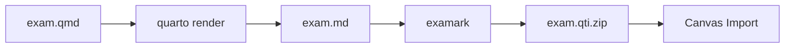

# Quarto Exam Extension

The Examark Quarto extension lets you author exams in `.qmd` files with R/Python code for dynamic content, then export to multiple formats: HTML preview, PDF, DOCX, and **QTI for Canvas**.

!!! warning "Two Separate Components"
    **Quarto extension** (authoring + preview) ≠ **CLI tool** (QTI conversion)

    - **Extension only:** `quarto add Data-Wise/examark` → preview formats (HTML/PDF)
    - **CLI only:** `npm install -g examark` → QTI conversion
    - **Both:** Required for complete `.qmd` → Canvas workflow

---

## Installation

### Extension Only (Preview Formats)

```bash
quarto add Data-Wise/examark
```

**What you get:**
- Formats: `exam-html`, `exam-pdf`, `exam-odt`, `exam-docx`, `exam-typst`
- Dynamic questions with R/Python
- Solution toggle
- LaTeX math support

**What you DON'T get:** QTI export (see "Complete Setup" below)

---

### Complete Setup (Preview + QTI)

For full workflow including Canvas export:

```bash
# Step 1: Quarto extension
quarto add Data-Wise/examark

# Step 2: CLI tool
npm install -g examark
```

**Workflow:**
```bash
quarto render exam.qmd --to exam-gfm  # Render
examark exam.md -o exam.qti.zip       # Convert
```

---

### Start from Template

```bash
quarto use template Data-Wise/examark
```

Creates new project with example `.qmd` files.

---

### Verify Installation

```bash
quarto list extensions
# Should show: exam  0.6.x  formats

examark --version
# Should show: 0.6.x (if CLI installed)
```

## Quick Start

1. Create a `.qmd` file with the `exam-gfm` format:

```yaml
---
title: "My Quiz"
format: exam-gfm

exam:
  qti: true
---

## 1. What is 2 + 2?

a) 3
b) **4** [correct]
c) 5
```

2. Render to Markdown:

```bash
quarto render quiz.qmd
```

3. Convert to Canvas QTI (the command is shown in the render output):

```bash
examark quiz.md -o quiz.qti.zip
```

!!! note "LaTeX Math Works Automatically"
    The `exam-gfm` format preserves `$...$` and `$$...$$` math notation by default. No extra configuration needed!

## Available Formats

| Format | Output | Use Case |
|--------|--------|----------|
| `exam-gfm` | Markdown | QTI conversion via CLI (recommended) |
| `exam-html` | HTML | Browser preview |
| `exam-pdf` | PDF | Printable exams |
| `exam-odt` | ODT | Google Docs, LibreOffice |
| `exam-docx` | DOCX | Microsoft Word |
| `exam-typst` | PDF | Modern PDF (Typst) |

### Multi-Format Rendering

Render to multiple formats simultaneously:

```yaml
format:
  exam-gfm: default      # For LMS import
  exam-pdf: default      # For printing
  exam-html: default     # For preview
```

```bash
quarto render exam.qmd  # Renders all formats
```

## Configuration Options

### Basic Configuration

```yaml
---
title: "Statistics Midterm"
format: exam-gfm

exam:
  qti: true              # Enable QTI export instructions
  solutions: false       # Hide solution blocks
  default-points: 2      # Default points per question
---
```

### Project Configuration (`_quarto.yml`)

For multi-file projects, configure defaults in `_quarto.yml`:

```yaml
project:
  type: default
  output-dir: _output

format:
  exam-html: default     # Default format for all documents

exam:
  solutions: false
  default-points: 2
```

### Full Configuration Reference

```yaml
exam:
  # QTI export
  qti: true                  # Show examark command after render

  # Content options
  solutions: false           # Show/hide solution blocks
  default-points: 2          # Default points when not specified
  include-answers: true      # Include [correct] markers in output
  shuffle-answers: false     # Randomize answer order (HTML only)
  grading-table: true        # Show grading table (PDF)

  # Typography (PDF/HTML)
  fonts:
    size: 11pt
    section-size: 1.2em
    question-title-size: 1em
    question-title-weight: 600
    question-desc-size: 1em
    question-desc-weight: 400

  # Answer space (PDF only)
  answer-space:
    multiple-choice: 0cm
    true-false: 0cm
    short-answer: 2cm
    numeric: 1.5cm
    essay: 5cm
    fill-blank: 1cm

  # Headers/Footers (PDF only)
  header:
    left: "{{course.number}}"
    right: "Name: _______"
  footer:
    center: "Page {{page}} of {{pages}}"
```

## Question Syntax

### Multiple Choice

```markdown
## 1. Question text [2 pts]

a) Wrong answer
b) **Correct answer** [correct]
c) Wrong answer
d) Wrong answer
```

### True/False

```markdown
## 2. [TF] The Earth is round. → True

## 3. [TF] Water boils at 50°C. → False
```

### Multiple Answers

```markdown
## 4. [MultiAns, 4pts] Select all prime numbers.

*a) 2
b) 4
*c) 5
*d) 7
e) 9
```

### Short Answer

```markdown
## 5. [Short] The capital of France is

Answer: Paris
```

### Numeric

```markdown
## 6. [Numeric, 3pts] Calculate 15 × 4

Answer: 60 ± 0
```

### Essay

```markdown
## 7. [Essay, 10pts] Explain your reasoning.

Provide a detailed explanation of your thought process.
```

## Solution Blocks

Wrap solutions in a div with the `.solution` class:

```markdown
## 1. What is 2 + 2?

a) 3
b) **4** [correct]
c) 5

::: {.solution}
**Explanation:** 2 + 2 = 4 by basic arithmetic.
:::
```

**Behavior by format:**

| Format | Solutions Visible |
|--------|-------------------|
| `exam-gfm` | Hidden |
| `exam-pdf` | Hidden |
| `exam-html` | Hidden (default) |

To show solutions in any format, set `exam.solutions: true`.

## Canvas Workflow

### Standard Workflow



### QTI Export with `exam.qti: true`

When you enable `exam.qti: true`, Quarto displays the examark command after rendering:

```yaml
---
title: "My Quiz"
format: exam-gfm

exam:
  qti: true
---
```

```bash
quarto render exam.qmd
# Output shows:
# 📦 QTI Export: After render completes, run:
#    examark exam.md -o exam.qti.zip
```

This makes the two-step workflow clear and easy to follow.

## LaTeX Math

The extension preserves LaTeX math for Canvas:

```markdown
## 1. Which formula represents variance?

a) $\mu = \bar{x}$
b) $s^2 = \frac{\sum(x_i - \bar{x})^2}{n-1}$ [correct]
c) $\sigma = \sqrt{\sigma^2}$
```

!!! tip "Math is enabled by default"
    The `exam-gfm` format includes `+tex_math_dollars` automatically. No extra configuration needed!

## Images and Figures

Images are automatically bundled in the QTI package:

```markdown
## 1. What does this graph show?


a) Normal distribution [correct]
b) Uniform distribution
c) Bimodal distribution
```

For R-generated figures:

````markdown
```{r}
#| echo: false
#| fig-cap: "Scatterplot"
plot(x, y)
```

## 1. Describe the relationship shown above.
````

**Quarto Cross-References (New!)**: You can use Quarto's `@fig-` syntax to reference figures in your questions. The figures and references are automatically handled when converting to QTI:

````markdown
```{r}
#| label: fig-residuals
#| fig-cap: "Residual Plot"
plot(fitted(model), residuals(model))
```

## 1. @fig-residuals shows the residual plot. What does this indicate?

a) Homoscedasticity [correct]
b) Heteroscedasticity
````

The `@fig-residuals` reference will be converted to "Figure 1" in the QTI output, and the image will be automatically bundled.

## Templates

We provide ready-to-use templates in the [`templates/quarto/`](https://github.com/Data-Wise/examark/tree/main/templates/quarto) folder:

| Template | Use Case |
|----------|----------|
| `minimal.qmd` | Minimal 3-question example |
| `starter.qmd` | Full-featured starter for beginners |
| `dynamic.qmd` | R code for randomization |
| `with-figures.qmd` | R-generated plots |

More examples in [`examples/quarto/`](https://github.com/Data-Wise/examark/tree/main/examples/quarto):

| Example | Description |
|---------|-------------|
| `statistics-exam.qmd` | Real statistics exam with LaTeX |
| `canvas-export.qmd` | Canvas-focused with all question types |
| `python-figures.qmd` | Python-generated plots |

## Troubleshooting

### Solutions appear in student version

Ensure `exam.solutions: false` is set:

```yaml
exam:
  solutions: false
```

### Math not rendering in Canvas

1. Check you're using correct delimiters: `$...$` for inline, `$$...$$` for display
2. Enable the math variant: `variant: +tex_math_dollars`
3. Verify Canvas has MathJax enabled

### Images missing in Canvas

1. Use relative paths in Markdown
2. Ensure images exist at the specified path
3. Check the QTI package includes images: `unzip -l exam.qti.zip`

### QTI import fails

Run the emulator to diagnose:

```bash
examark emulate-canvas exam.qti.zip
```

For Canvas New Quizzes, use strict validation:

```bash
examark verify exam.qti.zip --strict
```

Common fixes:

- Ensure each question has exactly one correct answer (except MultiAns)
- Check for special characters in question text
- Verify answer markers are properly formatted
