# Examify

<div class="grid" markdown>

<div markdown>

**Create exams from Markdown and export to Canvas QTI format.**

Write questions in simple Markdown, add correct answer markers, and generate Canvas-ready QTI packages. Built-in Canvas emulator catches errors before you upload.

[Get Started :material-arrow-right:](getting-started.md){ .md-button .md-button--primary }
[View on GitHub :material-github:](https://github.com/Data-Wise/examify){ .md-button }

</div>

<div class="badge-sidebar" markdown>

[](https://www.npmjs.com/package/examify)

[](https://github.com/Data-Wise/examify/actions/workflows/ci.yml)

[](https://github.com/Data-Wise/examify/actions/workflows/publish_docs.yml)

[](https://github.com/Data-Wise/examify/blob/main/LICENSE)

[](https://nodejs.org/)

</div>

</div>

---

## ✨ Features

<div class="grid cards" markdown>

- :material-file-document-edit:{ .lg .middle } **Markdown First**

    ---

    Write questions in simple, readable Markdown. Focus on content, not formatting.

- :material-math-integral:{ .lg .middle } **LaTeX Math**

    ---

    Full equation support with `$...$` inline and `$$...$$` display math.

- :material-image-multiple:{ .lg .middle } **Image Bundling**

    ---

    Automatically packages images into Canvas-ready QTI with proper manifests.

- :material-shield-check:{ .lg .middle } **Canvas Emulator**

    ---

    Predict import success *before* uploading. Catch errors early.

- :material-format-list-checks:{ .lg .middle } **6 Question Types**

    ---

    Multiple choice, true/false, multiple answer, essay, short answer, and numeric.

- :material-language-python:{ .lg .middle } **Quarto Integration**

    ---

    Use with R/Python for dynamic, randomized exam generation.

</div>

---

## 🚀 Quick Start

```bash
# No install needed!
npx examify quiz.md -o quiz.qti.zip

# Or install globally
npm install -g examify
examify quiz.md -o quiz.qti.zip
```

---

## 📝 Example

=== "Input (Markdown)"

    ```markdown
    # Statistics Quiz

    # Section: Multiple Choice

    ## 1. What is the mean of 2, 4, 6? [2 pts]

    a) Three
    b) **Four** ✓
    c) Five
    
    ## 2. [TF] Variance can be negative. → False

    ## 3. [Essay, 5pts] Explain the Central Limit Theorem.
    ```

=== "Output"

    ```text
    ✓ Generated QTI Package: quiz.qti.zip
      • 3 questions (MC, TF, Essay)
      • 1 section
      • 0 images bundled
    
    ✅ Ready for Canvas import!
    ```

---

## 🎯 Workflow

```mermaid
graph LR
    A[quiz.md] --> B[examify]
    B --> C[quiz.qti.zip]
    C --> D[Canvas Import]
    B --> E[emulate-canvas]
    E -->|✅ Success| D
    E -->|❌ Errors| F[Fix Issues]
    F --> A
```



---

## 📚 Templates

Start with a ready-made template:

| Template | Questions | Best For |
|----------|-----------|----------|
| [`starter-exam-md.md`](https://github.com/Data-Wise/examify/blob/main/examples/starter-exam-md.md) | 7 | Beginners |
| [`canvas-ready.md`](https://github.com/Data-Wise/examify/blob/main/examples/canvas-ready.md) | 21 | Full feature coverage |
| [`canvas-validation.md`](https://github.com/Data-Wise/examify/blob/main/examples/canvas-validation.md) | 9 | Testing all features |

**Quarto Users:** Check out the [Quarto Extension](extensions/quarto.md) for `.qmd` templates with R/Python code.

---

## 🔧 Commands

| Command | Description |
|---------|-------------|
| `examify file.md -o output.qti.zip` | Convert Markdown to QTI package |
| `examify verify package.qti.zip` | Validate package structure |
| `examify emulate-canvas package.qti.zip` | Simulate Canvas import |
| `examify check file.md` | Lint input file for errors |
| `examify file.md --preview` | Preview parsed questions |

See [Commands Reference](reference.md) for all options.

---

## 📖 Documentation

<div class="grid cards" markdown>

- :material-rocket-launch:{ .lg .middle } **[Getting Started](getting-started.md)**

    Installation and your first quiz in 5 minutes.

- :material-format-list-bulleted:{ .lg .middle } **[Input Formats](formats.md)**

    Complete question syntax reference.

- :material-test-tube:{ .lg .middle } **[Canvas Emulator](emulator.md)**

    Pre-validate before uploading.

- :material-school:{ .lg .middle } **[Tutorials](tutorials/index.md)**

    R/Quarto integration and more.

</div>

---

## 🤝 Contributing

See the [Contributing Guide](contributing.md) for development setup and guidelines.

---

## 📄 License

MIT © [Data-Wise](https://github.com/Data-Wise)
