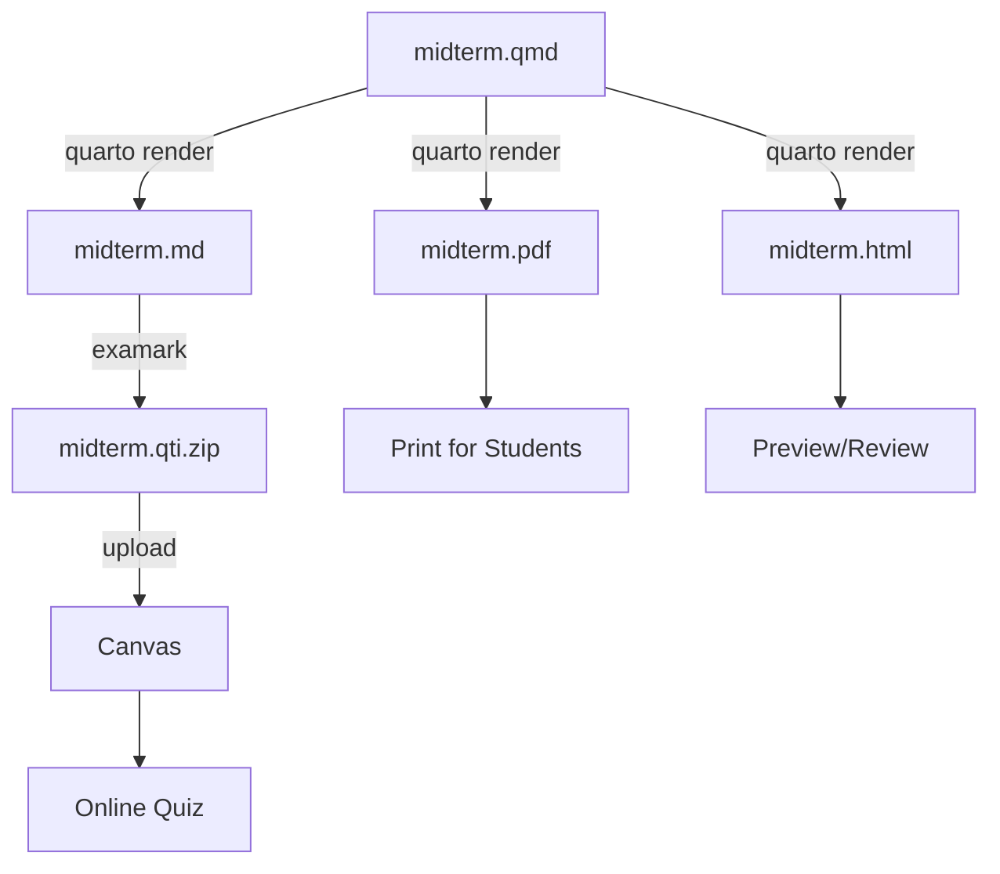

# R & Quarto Integration Tutorial

This tutorial walks you through creating a statistics exam using Quarto and R, then exporting it to Canvas.

## Why Use Quarto?

| Feature | Benefit |
|---------|---------|
| **Dynamic Content** | Generate random numbers for unique question variants |
| **Reproducibility** | Version control your exam source code |
| **Embedded Plots** | Auto-generate and embed R/Python plots |
| **Multi-Format** | One source → PDF, HTML, Canvas QTI |

## Prerequisites

- [Quarto](https://quarto.org) installed (≥ 1.4.0)
- [R](https://r-project.org) installed (for dynamic questions)
- [Examark](../getting-started.md) installed globally

## Step 1: Install the Extension

```bash
quarto add Data-Wise/examark
```

This creates `_extensions/exam/` in your project with the Lua filters and styling.

## Step 2: Create Your First Exam

Create a file called `midterm.qmd`:

```yaml
---
title: "Statistics Midterm"
format:
  exam-gfm:
    variant: +tex_math_dollars
exam:
  solutions: false
  default-points: 2
---

# Section: Descriptive Statistics

## 1. Mean Calculation [2 pts]

What is the mean of: 10, 20, 30, 40, 50?

a) 25
b) **30** [correct]
c) 35
d) 40

## 2. [TF] The median is resistant to outliers. → True
```

## Step 3: Render to Markdown

```bash
quarto render midterm.qmd --to exam-gfm
```

This creates `midterm.md` with properly formatted questions for Examark.

## Step 4: Convert to Canvas QTI

```bash
examark midterm.md -o midterm.qti.zip
```

## Step 5: Upload to Canvas

1. Go to your Canvas course
2. Navigate to **Settings → Import Course Content**
3. Select **QTI .zip file**
4. Upload `midterm.qti.zip`
5. Select import options and click **Import**

Your questions will appear in **Quizzes → Question Banks**.

---

## Adding R Code for Dynamic Questions

### Random Values

Use R inline code to generate unique values:

````markdown
```{r setup, include=FALSE}
set.seed(42)  # For reproducibility
values <- sample(10:50, 5)
correct_mean <- mean(values)
```

## 1. Calculate the Mean [2 pts]

Find the mean of: `r paste(values, collapse=", ")`

a) `r correct_mean - 5`
b) **`r correct_mean`** [correct]
c) `r correct_mean + 5`
d) `r correct_mean + 10`
````

### Generated Plots

Embed R-generated figures directly:

````markdown
```{r histogram, echo=FALSE, fig.cap="Score Distribution"}
hist(rnorm(100, mean=75, sd=10), 
     main="Exam Scores", 
     xlab="Score",
     col="steelblue")
```

## 3. Histogram Shape [2 pts]

What is the shape of the distribution shown above?

a) Positively skewed
b) Negatively skewed  
c) **Approximately normal** [correct]
d) Uniform
````

### Computed Answers

Calculate correct answers programmatically:

````markdown
```{r regression, include=FALSE}
x <- 1:10
y <- 2*x + 3 + rnorm(10, 0, 0.5)
model <- lm(y ~ x)
slope <- round(coef(model)[2], 2)
```

## 4. Regression Slope [3 pts]

Given the regression output, the slope is approximately:

a) `r slope - 0.5`
b) **`r slope`** [correct]
c) `r slope + 0.5`
d) `r slope + 1`
````

---

## Creating Multiple Exam Versions

### Version Strategy

Use different seeds to create parallel exam versions:

```r
# Version A
set.seed(100)

# Version B  
set.seed(200)

# Version C
set.seed(300)
```

### Automation Script

Create a shell script `build_exams.sh`:

```bash
#!/bin/bash

# Build Version A
sed -i '' 's/set.seed([0-9]*)/set.seed(100)/' midterm.qmd
quarto render midterm.qmd --to exam-gfm
mv midterm.md version-a.md
examark version-a.md -o version-a.qti.zip

# Build Version B
sed -i '' 's/set.seed([0-9]*)/set.seed(200)/' midterm.qmd
quarto render midterm.qmd --to exam-gfm
mv midterm.md version-b.md
examark version-b.md -o version-b.qti.zip

# Verify both
examark verify version-a.qti.zip
examark verify version-b.qti.zip
```

---

## Best Practices

### 1. Hiding Solutions

Wrap solutions in a `.solution` div – they're automatically hidden:

```markdown
## 1. What is the variance formula?

a) Wrong
b) **Correct** [correct]

::: {.solution}
The variance formula divides by n-1 for sample variance...
:::
```

### 2. Use [correct] Markers

The `[correct]` suffix is more reliable than bold or checkmarks when using R code:

```markdown
a) `r value_a`
b) `r value_b` [correct]
c) `r value_c`
```

### 3. Preview Before Export

Always preview in HTML first:

```bash
quarto render midterm.qmd --to exam-html
open midterm.html  # Check formatting
```

### 4. Verify the QTI Package

Run the Canvas emulator before uploading:

```bash
examark emulate-canvas midterm.qti.zip
```

---

## Complete Workflow Diagram



---

## Troubleshooting

### R Code Not Executing

Ensure you have:

1. R installed
2. `knitr` package installed: `install.packages("knitr")`
3. Code chunks configured properly

### Figures Not Appearing in Canvas

1. Check that figures are in the same directory as the `.md` file
2. Verify the QTI package includes them: `unzip -l exam.qti.zip`
3. Use relative paths in your Markdown

### Math Rendering Issues

1. Use `variant: +tex_math_dollars` in your YAML
2. Ensure Canvas has MathJax enabled (course settings)
3. Test with simple math first: `$x^2$`

---

## Next Steps

- [Dynamic Exams Tutorial](dynamic-exams.md) — Advanced R/Python techniques
- [Extension Reference](../extensions/quarto.md) — Full configuration options
- [Input Formats](../formats.md) — All question type syntax
