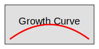

# Torture Test Quiz

# Section: Edge Cases

## 1. Why?

a) Because
b) **Why not**
c) 42

## 2. Special Chars & Encoding

What is the result of using characters like <, >, &, ", and ' in XML?
Also some unicode: ☃, 🚀, 汉字.

a) **They must be escaped**
b) They work raw

## 3. Code Block Test

Which code is correct?

```python
def foo():
    return "bar"
```

a) **Option A**
b) Option B

## 4. [MultiAns] Nested Logic

Select all primes less than 10.

*a) 2
*b) 3
*c) 5
*d) 7
e) 9
f) 1

## 5. [Short] Very short

Q?

Answer: A

## 6. Duplicate Image Test

Image 1:


Image 2 (Same file):


a) **Same**
b) Different

## 7. XSS Injection Test (Should Fail Validator)

Checking if basic scripts are stripped/flagged.

<script>alert('xss')</script>

a) **Safe**
b) Unsafe
